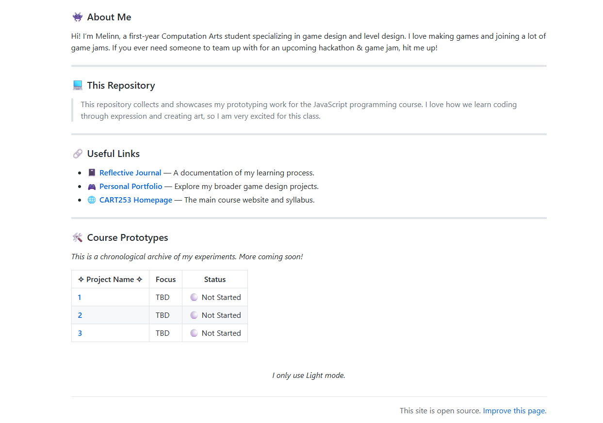

# Reflective Journal

<b>Entry 1: September 14, 2026</b>

 

## September 14, 2026

I have some previous experience working with Markdown files on GitHub, so the setup felt familiar. What surprised me this time is how much my own design philosophy has changed. I used to be the type of person who felt the need to decorate my README files highly aesthetically, especially for my personal repository. Lately, I find myself drawn to an approach that is simpler, more efficient, and driven by clear functionality. Currently, the only decorations I use are **custom shields**, which remain visually clean while conveying information effectively.

As for what is still difficult to understand, finding the balance between creative expression and a clean documentation structure can be a challenge for me. I want an efficient style that allows my creative coding to be the main focus, rather than distracting people with too much text formatting on the page itself.

When a future audience looks at my GitHub, I hope they immediately feel a sense of organized clarity. I want them to see my work as intentional and accessible. My aspiration for this class is to build a strong foundation where I can hone my JavaScript programming skills. I want the freedom to prototype complex mechanics efficiently, without wasting time trying to make my files look pretty every single week.

 

  
  
  *The website of Shields.io*

