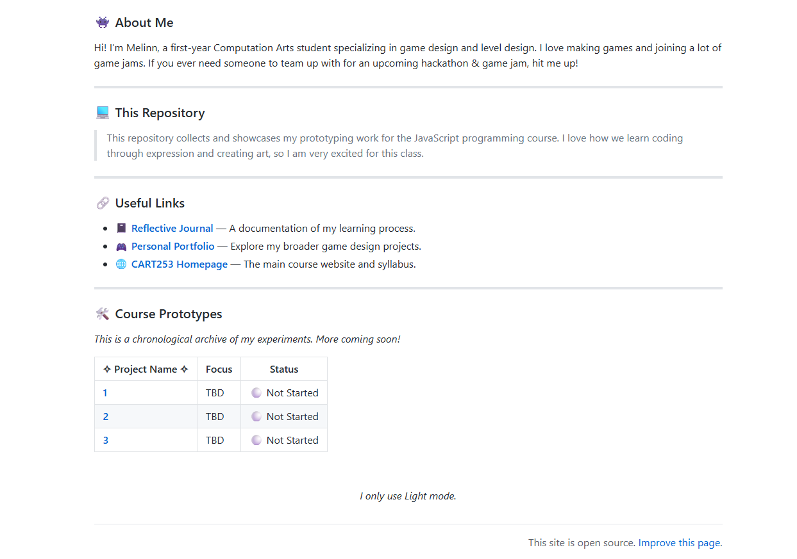

# Reflective Journal

<b>Entry 1: September 14, 2026</b>

 

## September 14, 2026

I have some previous experience working with Markdown files on GitHub, so the setup felt familiar. What surprised me this time is how much my own design philosophy has changed. I used to be the type of person who felt the need to decorate my README files highly aesthetically, especially for my personal repository. Lately, I find myself drawn to an approach that is simpler, more efficient, and driven by clear functionality. Currently, the only decorations I use are **custom shields**, which remain visually clean while conveying information effectively.

As for what is still difficult to understand, finding the balance between creative expression and a clean documentation structure can be a challenge for me. I want an efficient style that allows my creative coding to be the main focus, rather than distracting people with too much text formatting on the page itself.

When a future audience looks at my GitHub, I hope they immediately feel a sense of organized clarity. I want them to see my work as intentional and accessible. My aspiration for this class is to build a strong foundation where I can hone my JavaScript programming skills. I want the freedom to prototype complex mechanics efficiently, without wasting time trying to make my files look pretty every single week.

 

  
  
  *My README on Git Page*

<b>Entry 2: September 29, 2026</b>

 

## September 29, 2026

I was a bit busy this week, so I didn't have time to explore the new library as I expected, but I learned how to download the library from [YouTube](https://youtu.be/kduBV0OhrII). I found this guy who explained it very well. I played around a bit and created a spinning cube and a draggable cylinder. I hope I can spend more time soon starting to learn how to control the camera movement (to make it like an FPS) and export scenes from Unreal Engine 5.

 

  
  

<b>Entry 3: October 9, 2026</b>

 

## October 9, 2026

I experimented with camera movement in three.js this week, and it actually felt pretty familiar becasue it reminded me of learning game development in Construct 3, which also uses JavaScript to assign functions to all inputs to move in 3D space. Since three.js has a lot of ready-to-use functions, I spent most of my time this week reading through the ones that interested me and could help with my project.

When I started exporting 3D models from Unreal Engine 5, I ran into a problem with the metrics where UE5 works in centimeters, but three.js works in meters. I found a really useful website called [glTF Viewer](https://gltf-viewer.donmccurdy.com/) to help me preview how my 3D models will look in three.js. It helps me catch errors (like forgetting to export textures) before putting them into my code.

 

  

