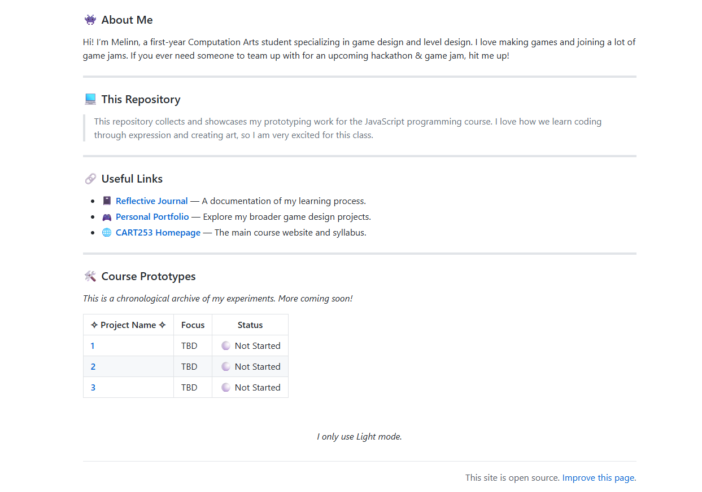

# Reflective Journal

<b>Entry 1: September 14, 2026</b>

 

## September 14, 2026

I have some previous experience working with Markdown files on GitHub, so the setup felt familiar. What surprised me this time is how much my own design philosophy has changed. I used to be the type of person who felt the need to decorate my README files highly aesthetically, especially for my personal repository. Lately, I find myself drawn to an approach that is simpler, more efficient, and driven by clear functionality. Currently, the only decorations I use are **custom shields**, which remain visually clean while conveying information effectively.

As for what is still difficult to understand, finding the balance between creative expression and a clean documentation structure can be a challenge for me. I want an efficient style that allows my creative coding to be the main focus, rather than distracting people with too much text formatting on the page itself.

When a future audience looks at my GitHub, I hope they immediately feel a sense of organized clarity. I want them to see my work as intentional and accessible. My aspiration for this class is to build a strong foundation where I can hone my JavaScript programming skills. I want the freedom to prototype complex mechanics efficiently, without wasting time trying to make my files look pretty every single week.

 

  
  
  *My README on Git Page*

<b>Entry 2: September 29, 2026</b>

 

## September 29, 2026

I was a bit busy this week, so I didn't have time to explore the new library as I expected, but I learned how to download the library from [YouTube](https://youtu.be/kduBV0OhrII). I found this guy who explained it very well. I played around a bit and created a spinning cube and a draggable cylinder. I hope I can spend more time soon starting to learn how to control the camera movement (to make it like an FPS) and export scenes from Unreal Engine 5.

 

  
  

<b>Entry 3: October 9, 2026</b>

 

## October 9, 2026

I experimented with camera movement in three.js this week, and it actually felt pretty familiar becasue it reminded me of learning game development in Construct 3, which also uses JavaScript to assign functions to all inputs to move in 3D space. Since three.js has a lot of ready-to-use functions, I spent most of my time this week reading through the ones that interested me and could help with my project.

When I started exporting 3D models from Unreal Engine 5, I ran into a problem with the metrics where UE5 works in centimeters, but three.js works in meters. I found a really useful website called [glTF Viewer](https://gltf-viewer.donmccurdy.com/) to help me preview how my 3D models will look in three.js. It helps me catch errors (like forgetting to export textures) before putting them into my code.

 

  

<b>Entry 4: October 20, 2026</b>

 

## October 20, 2026

1. I added collision to the objects in my scene so the player can't walk through them. I learned from this [video](https://youtu.be/9H3HPq-BTMo) and the [three.js Box3 documentation](https://threejs.org/docs/#Box3).

**Code changes:** [00553473697ebf511ba6b3a706fba881480be73f](https://github.com/mightymelinn/cart253/commit/00553473697ebf511ba6b3a706fba881480be73f)
> I created an invisible bounding box for every solid object using `new THREE.Box3().setFromObject(object)`, and a box around the player. Every frame, my function `hitSomething()` checks if the player's box intersects any object's box. Before moving, the game remembers where the player is standing. If the new position doesn't intersect anything, the movement is continued. If it does, the movement is undone, so the player stops at the edge of the object. The video uses collision to change an object's look when touched. I adapted it to block the player's movement. For the spinning cube, I used `cube.geometry.computeBoundingBox()` so the box can follow the cube as it rotates.

2. I added an interaction where the player can pick up the object they are looking at. I used raycasting, based on our discussion last last week.

**Code changes:** [2e0c656d242e55997d9975bfbf8bd130674a0fef](PASTE-COMMIT-LINK-HERE)
> Every frame, a ray is cast from the center of the screen (where the player is looking). It only checks objects in my pickable list (currently only the cube). If the ray hits it within 3 units, the object is highlighted white. If the player presses E while an object is highlighted, it is removed from everything.
>
> I first watched this [video](https://youtu.be/tgwS1xxzc9s), but I was quite confused, so I also used the [three.js interactive cubes example](https://threejs.org/examples/#webgl_interactive_cubes) and the [three.js picking manual](https://threejs.org/manual/#en/picking) as references. I found that I prefer reading documentation over following YouTube videos.
>
> Right now, picked-up objects simply disappear, and I don't store any data yet. My idea is to put each collected object into an array, and once the player has collected 3 objects, call an end function. I'll figure out how next week.

My plan changed a bit from my weekly milestones. I first planned to use a mouse click to pick up objects, but I used the E key instead, since it's more common interact key in FPS games. I decided not to import the house layput from UE5 yet, because I still need to make changes to my map. However, I've already learned how to export assets from UE5 as .glb and load them into three.js, so I should be ready when the map is done. I also made the lighting more realistic by adding a directional light (+ shadows). I also added looping ambience sound that starts when the player clicks into the game.

**Next week:** my main.js is getting long and hard to scroll through, so I want to start organizing my code into separate files. 

 

