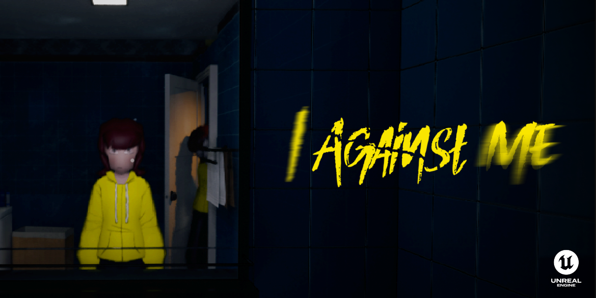

# 

*This repository is for collecting my works from CART253 for Fall 2026. By the way, I am developing a psychological horror game on Steam called I Against Me! PLEASE wishlist it!*

 

 

### 👾 About Me
Hi! I'm Melinn, a first-year Computation Arts student specializing in game design and level design. I love making games and joining a lot of game jams. If you ever need someone to team up with for an upcoming hackathon & game jam, hit me up!

---

### 💻 This Repository
> This repository collects and showcases my prototyping work for the JavaScript programming course. I love how we learn coding through expression and creating art, so I am very excited for this class.

---

### 🔗 Useful Links
* 📓 **[Reflective Journal](journal.md)** — A documentation of my learning process.
* 🎮 **[Personal Portfolio](https://sites.google.com/view/melinnportfolio/home)** — Explore my broader game design projects.
* 🌐 **[CART253 Homepage](https://pippinbarr.com/cart253/)** — The main course website and syllabus.

---

### 🛠️ Course Prototypes
*This is a chronological archive of my experiments. More coming soon!*

| ✧ Project Name ✧ | Focus | Status |
| :--- | :--- | :---: |
| **[1](#)** | TBD | ⚪ Not Started |
| **[2](#)** | TBD | ⚪ Not Started |
| **[3](#)** | TBD | ⚪ Not Started |

 

  <i>I only use Light mode.</i>

